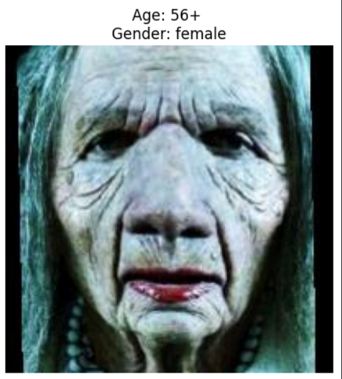
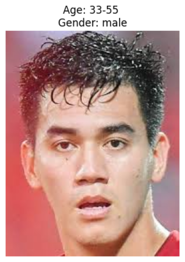

# Gender and Age Detection
### Dataset
UTK dataset
### Preprocessing
- **Image Resizing:** All images were resized to 128x128 pixels.
- **Grayscale Conversion:** Converted images to grayscale.
- **Edge Detection:** Used the Canny edge detection algorithm to extract features.
- **Data Splitting:** Split data into training (80%) and testing (20%) sets.
- **Feature Scaling and PCA:** Standardized features and reduced dimensionality using Principal Component Analysis (PCA).
### Algorithms and Models
- Support Vector Machine (SVM)
- k-Nearest Neighbors (KNN)
- Logistic Regression
- Random Forest
### Results
- **SVM:** Achieved the highest accuracy for both age (62%) and gender (77%) predictions.
- **KNN:** Provided reasonable accuracy but was outperformed by SVM.
- **Logistic Regression:** Showed competitive results for gender prediction.
- **Random Forest:** Effective but not as accurate as SVM for this dataset.
### Testing
- Run demo results:

